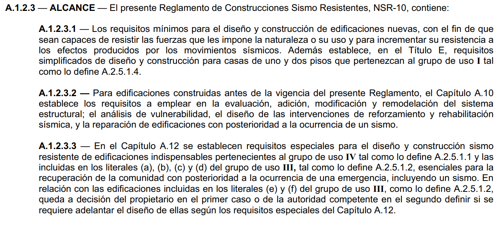
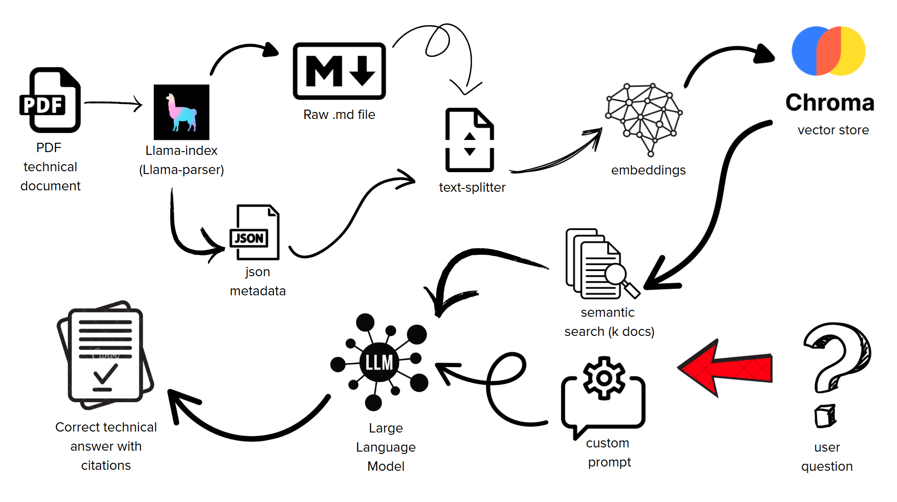
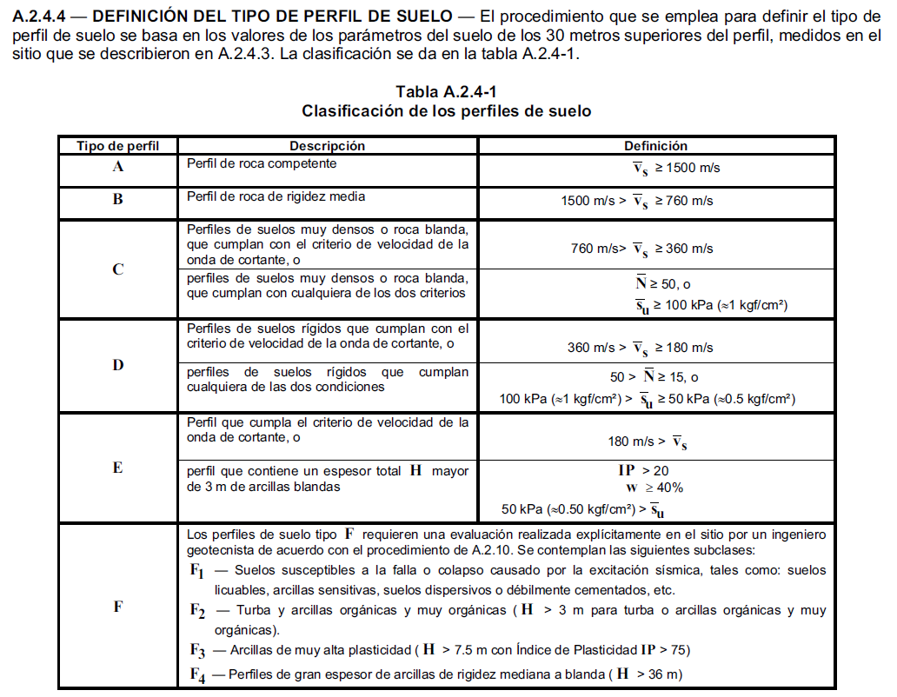
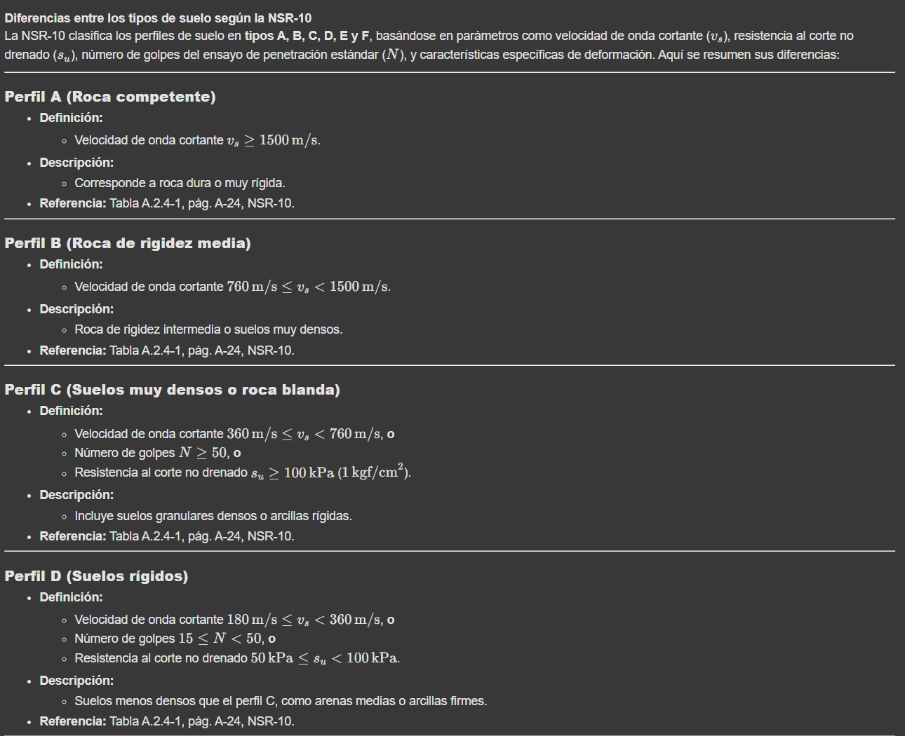
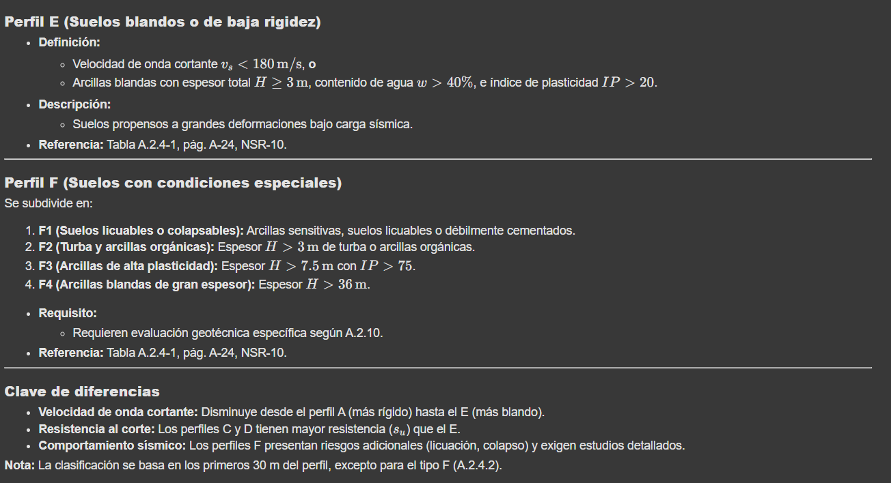

<style>
  .justified-text {
    text-align: justify;
  }
  .centered-text {
    text-align: center;
  }
</style>

## Introducción.

<div class="justified-text">
En diversas disciplinas de la ingeniería, es necesario seguir lineamientos específicos para la elaboración de diseños (en forma de normativas), presentación de proyectos (en forma de pliegos de condiciones o requerimientos de entidades públicas) así como también el seguimiento de los mismos (en forma de informes de cumplimiento).

Con lo anterior podemos identificar dos patrones:

1. Se tiene un documento base, de naturaleza extensa y rigurosa; que debe ser revisado a detalle por un equipo de profesionales con extrema cautela.

2. La información del proyecto crece a medida que se avanza en el mismo, y se generan documentos de soporte que deben ser revisados por los mismos profesionales para poder cumplir con labores de tipo administrativas.

Estas tareas en un principio no deberían significar mayor reto para los ingenieros.

Sin embargo, a medida que el volumen de documentos crece (debido al paso del tiempo y avances en el proyecto) o la complejidad de los mismos aumenta (documentos con miles de páginas y compleja estructura), nos encontramos con la limitación del tiempo y de nuestra propia memoria. Teniendo así que dedicar horas de trabajo a revisar y releer documentos una y otra vez, para poder encontrar la información que necesitamos; perdiendo tiempo en el proceso que puede ser utilizado para tareas más importantes o con mayor peso ingenieril.

Es allí cuando desearíamos que esas montañas de documentos cobraran vida y pudiéramos preguntarles directamente sobre la información que contienen, y que nos respondieran de forma precisa y concisa. Las buenas noticias son que esto ya es posible, gracias a los avances en inteligencia artificial y procesamiento de lenguaje natural.

</div>

## En este articulo.

<div class="justified-text">
Para hacer un primer acercamiento a la idea planteada, vamos a enfocarnos en el primer problema descrito, el cual es la revisión de documentos normativos. En este caso, tomaremos como referencia la NSR-10; la cual es la norma sismorresistente que rige en Colombia.

Esta normativa se divide en 11 títulos diferentes, nombrados de la A a la K, el documento en conjunto posee más de 1700 páginas y su estructura es bastante compleja y en práctica muy rigurosa, haciendo que su lectura sea muy poco fluida al tener que saltar entre apartados para poder encontrar la información necesaria.

</div>


| Título | Nombre                                                         | Páginas |
| ------ | -------------------------------------------------------------- | ------- |
| **A**  | REQUISITOS GENERALES DE DISEÑO Y CONSTRUCCIÓN SISMO RESISTENTE | 175     |
| **B**  | CARGAS                                                         | 88      |
| **C**  | CONCRETO ESTRUCTURAL                                           | 587     |
| **D**  | MAMPOSTERÍA ESTRUCTURAL                                        | 74      |
| **E**  | CASAS DE UNO Y DOS PISOS                                       | 40      |
| **F**  | ESTRUCTURAS METÁLICAS                                          | 600     |
| **G**  | ESTRUCTURAS DE MADERA Y ESTRUCTURAS DE GUADUA                  | 166     |
| **H**  | ESTUDIOS GEOTÉCNICOS                                           | 66      |
| **I**  | SUPERVISIÓN TÉCNICA                                            | 22      |
| **J**  | REQUISITOS DE PROTECCIÓN CONTRA INCENDIOS EN EDIFICACIONES     | 32      |
| **K**  | REQUISITOS COMPLEMENTARIOS                                     | 63      |

<div class="centered-text"> 

_**Tabla 1:** **Títulos de la NSR-10 con páginas por titulo**_
</div>

<div class="justified-text">

_**Disclaimer:** La intención de la creación de este tipo de herramientas no es para promover la poca rigurosidad o irresponsabilidad en los profesionales, ya que el criterio de los mismos debería ser el encargado de la toma de decisiones clave en los proyectos; este tipo de herramientas deben entenderse más como herramientas de consulta y de ayuda en la interpretación; más adelante veremos cómo podemos pedir que se realicen anotaciones a las partes citadas del documento, para que los profesionales puedan corroborar la información que se les brinda._

</div>

## Primero que todo, ¿Qué es RAG?

<div class="justified-text">
RAG (Retrieval-Augmented Generation, en español Generación Aumentada por Recuperación) es una técnica que combina búsqueda de información con generación de texto para que los modelos de IA (como ChatGPT) den respuestas más precisas y actualizadas.

En palabras más simples, es como darle la habilidad a los modelos del lenguaje de poder leer documentos que muy probablemente no se encuentran en su entrenamiento, pero no solamente leer, sino retener la información e interpretarla para poder generar respuestas más precisas y actualizadas en el contexto dado.

Intentando ponernos un poco más técnicos, lo que sucede es que se realiza una búsqueda semántica de la pregunta en el documento, y se eligen un número **_k_** de fragmentos que semánticamente son similares a la pregunta, de esta manera se alimenta con este contexto enriquecido al modelo del lenguaje y junto con estrategias de instrucciones o **_"prompting"_**; podemos obtener una respuesta precisa que solo se basa en la información suministrada. Lo cual nos interesa ya que para el caso de normativas es necesario ser muy riguroso y preciso.

</div>

## Manos a la "obra".
<div class="justified-text">
Para efectos de avanzar en la solución del problema, vamos a enfocarnos en el primer título de la normativa, ya que tiene bastante naturaleza cualitativa y está lleno de conceptos, por lo que puede servirnos como un buen punto de partida.

### 1. Caracterización del documento.
Como recién se mencionó, el título con el cual se hará el ejercicio será el "A", que contiene los requisitos generales para el diseño y construcción sismo resistente. Es un documento de 175 páginas en formato PDF de 1.9 Mb, que contiene conceptos, gráficas, tablas y fórmulas complejas en notación que parece ser LaTeX; en cuanto a su estructura podemos ver que está compuesto por capítulos y secciones con numeración específica, que se utilizan para identificar cada apartado del documento y poder hacer referencias precisas en cualquier ubicación que sea necesaria.


<div class="centered-text" >

_**Figura 1:** *Ejemplo de estructura del documento (fuente: NSR-10)*_
</div>

### 2. Flujo propuesto.
#### 2.1 Entorno de desarrollo elegido.
- Al ser esta una prueba de concepto, y con la necesidad de probar diferentes modelos y configuraciones con más facilidad, el flujo de trabajo se llevará se realizará en una instancia de Google Colab; de igual manera notaremos que las tecnologías utilizadas son open-source, entonces dependerá de nuestro hardware (no son necesarias grandes infraestructuras a día de hoy) el que podamos tenerlas en local. 

#### 2.2 Esquema del flujo.


<div class="centered-text" >

_**Figura 2:** *Flujo propuesto para la implementación de RAG en el documento (fuente: elaboración propia)*_
</div>
<br>

#### 2.3 Preliminares.

- Debido a la complejidad del formato PDF, se hace necesario convertirlo en un formato más simple, esto porque si en el proceso de extracción mantenemos el formato original; nos encontramos con que no se mantienen la estructura de las tablas y muchos símbolos referentes a ecuaciones no son interpretados de manera correcta; dificultando el poder responder con precisión.
- El formato elegido para la conversión será markdown (.md) porque nos brinda una serie de ventajas como pueden ser:
    - Posee una estructuración clara y visible que separa entre encabezados y secciones; lo que ayuda al modelo a entender la jerarquía y organización del contenido.
    - Facilita la representación de información estructurada, como pasos, características o datos comparativos.
    - Permite la inclusión de bloques de código o ecuaciones de diseño, lo que facilita el entendimiento de este tipo de información y posterior presentación en las respuestas.
    - Otra ventaja es que en el mismo proceso de "parsear" los documentos podemos obtener metadatos en formato JSON que son de bastante ayuda para el filtrado de fragmentos importantes, además de facilitar la ubicación (páginas, secciones) de la información relevante en el documento.

- Este proceso podría hacerse en local gracias a la librería **Marked-PDF** de Python, con muy buenos resultados finales. Pero para nuestra instancia de Google Colab tenemos la limitación de dejar durante cierto tiempo un proceso en ejecución, por lo que nos encontramos con una primera barrera. La buena noticia es que gracias a _**Llama Index**_ y sus servicios en la nube podemos realizar este proceso con mayor velocidad; ya que su prueba gratuita es bastante generosa. Además para nuestro ejemplo solo es necesario hacer este proceso una vez.

<br>

#### 2.4 División de documentos y creación de embeddings.

- Una vez tenemos el archivo markdown y los metadatos es momento de dividir el documento en _"**chunks**"_ (fragmentos cada *_n_* tokens), de manera que el proceso sea más eficiente para el LLM. Este valor es clave ya que dividir el documento en un número muy bajo de palabras puede hacer que se de pérdida de contexto y a su vez alucinación. Por eso mismo y también con la intención de preservar el mayor contexto posible se agrega un _"**chunk overlap**"_ (es decir un solapamiento entre ambos fragmentos de texto). Este proceso lo realizaremos gracias a la librería de **Langchain** en Python, que nos proporciona un marco para realizar este tipo de procesos.

- El siguiente paso es convertir estos fragmentos en _**Embeddings**_, que son representaciones vectoriales densas que codifican la semántica y relaciones contextuales de cada fragmento en un espacio de alta dimensionalidad. En esta ocasión usaremos la Base de datos vectorial de **Chroma DB**, que utiliza por debajo **SQLite3** por lo que es bastante cómodo y nos ahorra configuraciones.

```python
from langchain.embeddings import HuggingFaceEmbeddings
from langchain.text_splitter import RecursiveCharacterTextSplitter
from langchain.vectorstores import Chroma
from langchain.docstore.document import Document
import os
import shutil

# Cargar markdown
with open('/content/Titulo-A-NSR-10.pdf.md', 'r', encoding='utf-8') as file:
    markdown_text = file.read()

# Crear Document para metadata
document = Document(
    page_content=markdown_text,
    metadata={"source": "/content/Titulo-A-NSR-10.pdf.json"}
)

# Dividir texto
text_splitter = RecursiveCharacterTextSplitter(
    chunk_size=9000,
    chunk_overlap=600,
    length_function=len
)

split_docs = text_splitter.split_documents([document])

# Embeddings locales
embeddings = HuggingFaceEmbeddings(
    model_name="paraphrase-multilingual-MiniLM-L12-v2",
    model_kwargs={"device": "cpu"},
    encode_kwargs={"normalize_embeddings": True}
)

# Definir ruta
persist_dir = "./chroma_db"

# Limpiar base anterior si existe para evitar errores de readonly
if os.path.exists(persist_dir):
    print("🧹 Eliminando base de datos previa de Chroma...")
    shutil.rmtree(persist_dir)

# Crear Vector Store limpia
vector_store = Chroma.from_documents(
    documents=split_docs,
    embedding=embeddings,
    persist_directory=persist_dir
)

print("✅ Vector Store creada y almacenada en disco.")
```

<br>

#### 2.5 Búsqueda Semántica por similitud.
- Para este punto ya tenemos la primera mitad de nuestro **RAG** configurada, ahora es momento de dotar al LLM del contexto, para esto necesitamos la opción de realizar una búsqueda teniendo en cuenta la pregunta del usuario en nuestra base de datos vectorial (que recordemos contiene representaciones del contexto y significado de cada fragmento). De nuevo acá nos apoyaremos de **Langchain** donde es muy fácil realizar este proceso. Es tan fácil como agregar al **"prompt"** el siguiente contexto que contiene los resultados de la búsqueda, donde **_k_** es el número de fragmentos que se van a recuperar (se recomienda que este número no sea tan grande con el fin de que no se pierda el asunto principal de la pregunta).

```python
# Busqueda semantica por similaridad.
def construir_contexto_limitado(pregunta, k=4):
    docs = vector_store.similarity_search(pregunta, k=k)
    contexto = "\n---\n".join([doc.page_content for doc in docs])
    return contexto
```

<br>

#### 2.6 Estrategias de Prompting.
- Como último paso en las configuraciones es necesario agregarle ciertas instrucciones al LLM con el fin de ajustar su personalidad, asegurarnos que no use información de otras fuentes o incluso especificarle algún formato de salida para facilitar la visualización de fórmulas o tablas. Como bonus se recomienda el uso de *modelos razonadores* para tener más rigurosidad y análisis previo a la respuesta.

```python
# Ejemplo de instrucciones.
  respuesta = client.chat.completions.create(
      model="deepseek-reasoner",
      messages=[
          {"role": "system", "content": "Eres un experto en normativa NSR-10 estructural colombiana, responde de forma precisa y con base en el texto dado."},
          {"role": "user", "content": prompt}
      ],
      temperature=0.2
  )
```
<br>

### 3. Análisis de resultados
Con el fin de determinar si se ha conseguido el objetivo se deberían realizar estrategias mas extensas y someter a preguntas complejas al modelo. Esto puede ser objeto de un próximo articulo, por el momento nos limitaremos a realizarle una pregunta en base a una tabla, para ver si fue capaz de extraer la información. Teniendo en cuenta que gran parte de la información importante del mismo se encuentra contenido en tablas. La pregunta en cuestión a realizar será. 

```python
pregunta = "¿puedes explicarme las diferencias entre los distintos tipos de suelo que plantea la nsr-10?"
```
La respuesta a esta pregunta para quienes hemos trabajado con esta normativa, sabemos que se encuentra en una tabla y podemos recordar su estructura y que datos contiene, pero difícilmente recordaríamos el capitulo o tabla exacta de memoria.

la tabla en cuestión que clasifica los tipos de suelos es la A.2.4-1 y se presenta de la siguiente forma.




<div class="centered-text" >

_**Figura 3:** *Tabla A.2.4-1 clasificación de tipos de suelo (fuente: NSR-10)*_
</div>
Como podemos apreciar es una tabla con bastantes formulas y símbolos, además de una estructura que no es del todo regular, esto la hace una oportunidad interesante de ver si se pudo extraer la información. A continuación los resultados obtenidos.




<div class="centered-text" >

_**Figura 4 y 5:** *Respuestas obtenidas por el RAG a la pregunta realizada*_
</div>

Podemos notar que hizo una extracción perfecta de la información sin importar la complejidad de la tabla y fue capaz de relacionar satisfactoriamente las columnas y filas. Además fue capaz de citar la tabla a la cual hicimos referencia con anterioridad; sumado a esto fue capaz de encontrar las definiciones de los símbolos como por ejemplo, la resistencia al corte no drenado que se encontraba en paginas anteriores a la tabla. Por ultimo respondió a nuestra pregunta razonando y basándose solo en la información dada.

<br>

### 4. Conclusiones
Gracias a los avances en inteligencia artificial pudimos crear las bases para un asistente que facilite las consultas de información técnica a los ingenieros, ahorrándoles tiempo en temas que ya conocen y ayudándoles a explorar y comprender temas nuevos con mayor fluidez. Permitiendo la toma de decisiones mejor informadas y más rápidas. 

<br>

### 5. Pasos a seguir
Con esta base es fácil imaginarnos un chatbot que este alimentado con normativas completas y podamos interactuar con el de una manera mas intuitiva y amigable. Que además aprovechando conceptos modernos en el mundo de la IA, como *MCP servers* nos permitan automatizar procesos complejos y repetitivos, con un marco riguroso para asegurarnos de la información o resultados que nos proporcionan.

</div>

