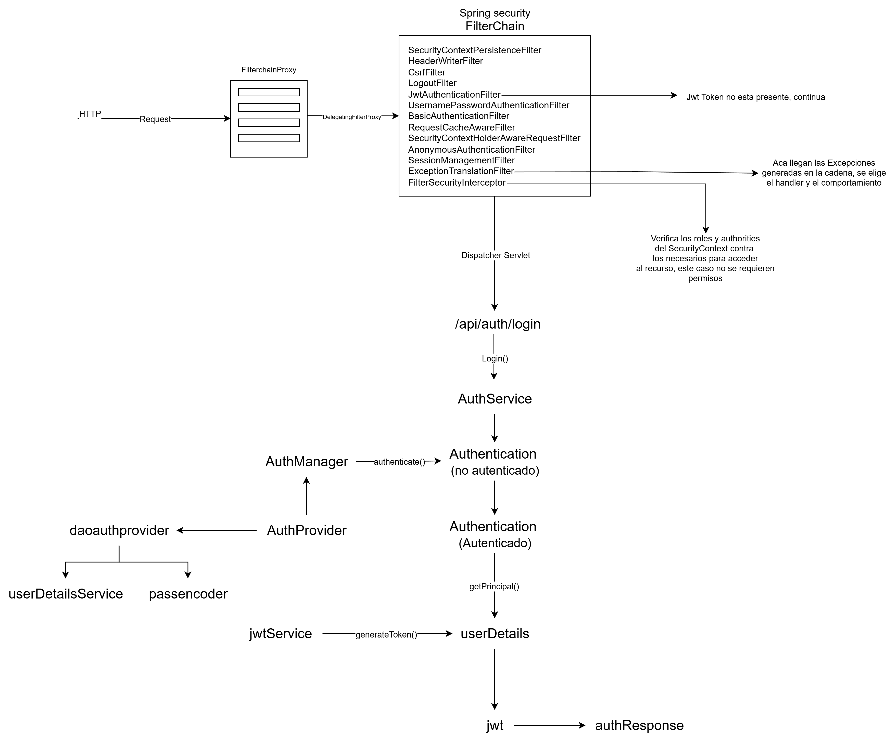
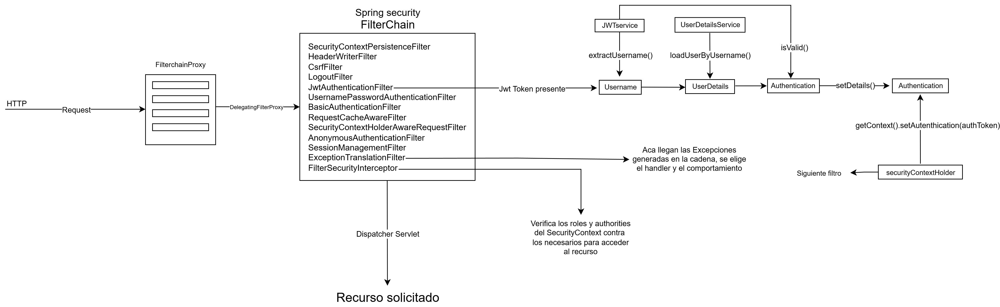

<style>
  .justified-text {
    text-align: justify;
  }
</style>

## Introducción.

### ¿Qué es Spring Security?
<div class="justified-text">
Spring Security es un framework para Java que permite proteger aplicaciones web y APIs. Facilita la implementación de mecanismos de autenticación (quién puede acceder) y autorización (qué puede hacer cada usuario) sin necesidad de escribir toda la lógica de seguridad desde cero. Además, es flexible, por lo que se puede adaptar a distintos escenarios y necesidades de seguridad.
</div>

### Importancia de la seguridad en aplicaciones web modernas
<div class="justified-text">
Hoy en día, las aplicaciones web manejan información sensible, desde datos personales hasta transacciones financieras. Aplicar seguridad correctamente no solo protege la información, sino que también genera confianza en los usuarios y ayuda a cumplir regulaciones legales. Sin una buena implementación, las aplicaciones son vulnerables a ataques como inyecciones de código o acceso no autorizado.
</div>

### Objetivo del artículo
<div class="justified-text">
El objetivo de este artículo es entender cómo funciona Spring Security bajo el capó, para que no solo se aplique seguridad “por copiar y pegar”, sino que se comprenda qué ocurre cuando un usuario se autentica o accede a distintos recursos. Veremos cómo se organiza internamente, qué roles cumplen sus componentes principales y cómo se procesan las solicitudes a través de cadenas de filtros y proxies.
</div>


## Fundamentos de Seguridad en Aplicaciones Web

### Conceptos básicos: autenticación vs autorización

- Autenticación (Authentication): Es el proceso de verificar la identidad de un usuario. Por ejemplo, cuando alguien ingresa su nombre de usuario y contraseña, el sistema valida que esa persona es quien dice ser.

- Autorización (Authorization): Determina qué acciones puede realizar un usuario autenticado. Por ejemplo, un usuario puede ver su perfil, pero solo un administrador puede eliminar otros usuarios.

### Modelos comunes de seguridad
En las aplicaciones web, los modelos de seguridad más comunes incluyen:

- Roles: Etiquetas que agrupan permisos. Ejemplo: USER, ADMIN.

- Permisos o authorities: Acciones específicas que un rol puede realizar, como READ_BOOK o DELETE_ORDER.

- Matriz de control de acceso (ACL): Define qué roles o usuarios tienen acceso a cada recurso o acción.

Spring Security permite trabajar tanto con roles como con permisos detallados, lo que facilita implementar políticas de acceso claras y mantenibles.

## Arquitectura General de Spring Security
### Breve historia y evolución
<div class="justified-text">
Spring Security nació como un proyecto llamado Acegi Security en 2003, con el objetivo de proporcionar seguridad para aplicaciones Java EE. En 2008 se integró oficialmente al ecosistema Spring y cambió su nombre a Spring Security. Desde entonces, ha evolucionado para soportar REST APIs, OAuth2, JWT y arquitecturas modernas basadas en microservicios, manteniendo siempre un enfoque modular y flexible.
</div>

### Principios de diseño
Spring Security se basa en tres principios clave:

- Modularidad: Cada componente tiene una función específica y puede ser reemplazado o extendido sin afectar el resto del sistema.

- Extensibilidad: Permite personalizar mecanismos de autenticación, autorización y manejo de errores según las necesidades de la aplicación.

- Integración: Se integra de forma nativa con Spring y sus proyectos relacionados, facilitando la configuración y la coherencia en toda la aplicación.

### Componentes principales de Spring Security

#### Filter Chain (Filtros de seguridad):
<div class="justified-text">
La cadena de filtros es donde ocurre gran parte de la magia de Spring Security. Cada solicitud HTTP pasa por esta secuencia de filtros, que pueden autenticar al usuario, verificar tokens, manejar sesiones o aplicar políticas de seguridad. La interacción entre filtros garantiza que la solicitud solo llegue a los recursos autorizados si cumple con todas las reglas definidas.
</div>

#### AuthenticationManager:
<div class="justified-text">
Gestiona la autenticación de los usuarios. Recibe credenciales y decide si son válidas, delegando en distintos AuthenticationProvider. Aunque su trabajo principal es validar identidades, en la práctica se coordina estrechamente con los filtros, que son quienes envían las solicitudes de autenticación.
</div>

#### UserDetailsService:
<div class="justified-text">
Es el encargado de cargar los datos del usuario (nombre, contraseña, roles y permisos) desde la base de datos o un servicio externo. Trabaja mano a mano con el AuthenticationManager para verificar credenciales y con los filtros para establecer el contexto de seguridad.
</div>

#### SecurityContextHolder:
<div class="justified-text">
Almacena información del usuario autenticado durante toda la vida de la solicitud. Gracias a él, cualquier parte de la aplicación puede conocer la identidad y permisos del usuario actual. Este componente es esencial para que los filtros y el AccessDecisionManager tomen decisiones coherentes sobre acceso.
</div>

#### AccessDecisionManager:
<div class="justified-text">
Decide si un usuario tiene permiso para acceder a un recurso específico. Para ello, evalúa roles y permisos del usuario frente a las reglas de seguridad definidas, basándose en la información que le provee el SecurityContextHolder. Su interacción con los filtros asegura que la autorización se aplique de manera consistente antes de procesar la lógica de la aplicación.
</div>

> IMPORTANTE: Estos componentes no funcionan de forma aislada: cada solicitud atraviesa la cadena de filtros, se autentica con el AuthenticationManager, se consulta el UserDetailsService para obtener información del usuario, se guarda el contexto en SecurityContextHolder y finalmente el AccessDecisionManager determina si el acceso es permitido. En la próxima sección veremos en detalle cómo ocurre esta interacción paso a paso.


## Proxy Chains en la Cadena de Servlets

### ¿Qué es un Servlet y un Servlet Filter?
<div class="justified-text">
Un Servlet es un componente de servidor que recibe solicitudes HTTP y genera respuestas, generalmente usado para procesar lógica de negocio y devolver contenido web dinámico. Los Servlet Filters son componentes definidos por la especificación Java EE (Java Platform, Enterprise Edition), un conjunto de estándares y APIs para desarrollar aplicaciones empresariales en Java, incluyendo aplicaciones web, servicios REST y sistemas distribuidos.
</div>

Los filtros interceptan solicitudes HTTP antes de que lleguen a un Servlet y se organizan en una cadena, de manera que cada solicitud pasa por todos los filtros registrados antes de alcanzar el recurso final. Esto permite realizar tareas como:

- Autenticación y autorización

- Registro de actividad (logging)

- Transformación de datos de la solicitud o respuesta

- Manejo de excepciones

<div class="justified-text">
Spring Security se apoya en esta infraestructura estándar de Java EE, ejecutando su lógica de seguridad sobre la cadena de filtros existente en el contenedor de Servlets, lo que garantiza compatibilidad y consistencia en cualquier servidor que implemente la especificación.
</div>

### Introducción a las proxy chains en Java EE/Servlet API
<div class="justified-text">
Las proxy chains son un patrón en el que un objeto actúa como intermediario entre la solicitud y el recurso real. En Java EE, la cadena de filtros de Servlets funciona como una proxy chain: cada filtro puede decidir continuar con la cadena o bloquear la solicitud según ciertas condiciones. Spring Security se integra sobre esta misma cadena, asegurando compatibilidad y reutilizando mecanismos estándar del contenedor.
</div>

### Cómo Spring Security utiliza la cadena de filtros (Filter Chain Proxy)
<div class="justified-text">
Spring Security implementa su propia Filter Chain Proxy, que agrupa todos los filtros de seguridad de la aplicación en una sola cadena. Cada solicitud pasa primero por este proxy, que delega la ejecución a los filtros internos (autenticación, autorización, CSRF, CORS, etc.). Al usar el contenedor de Servlets y la especificación estándar, Spring garantiza que la seguridad se aplique de manera consistente y predecible en cualquier servidor Java EE.
</div>


### Explicación del DelegatingFilterProxy y su rol
<div class="justified-text">
DelegatingFilterProxy es un filtro de integración que actúa como puente entre el contenedor Servlet y los beans de Spring Security. Permite que los filtros definidos como beans de Spring se ejecuten dentro de la cadena de filtros estándar del contenedor, asegurando compatibilidad con la especificación de Servlets y centralizando la configuración de seguridad.
</div>


<div class="justified-text">
Comprender cómo Spring Security se apoya en la infraestructura de Servlets y cómo funciona la cadena de filtros permite anticipar y controlar el comportamiento de la seguridad en cada solicitud. Este conocimiento facilita tareas prácticas como diagnosticar problemas de autenticación, configurar correctamente la autorización por roles y permisos, o implementar filtros personalizados de manera segura y eficiente, haciendo que la seguridad de la aplicación sea más predecible y confiable.
</div>

## Componentes Arquitectónicos Clave
Spring Security está construido sobre una arquitectura modular donde cada componente tiene un rol específico dentro del flujo de autenticación y autorización. Conocer estos componentes ayuda a comprender qué sucede detrás de escena, cómo personalizar la seguridad de manera efectiva y cómo adaptarla a arquitecturas modernas basadas en stateless y tokens JWT.

### Security Filter Chain y la necesidad de filtros personalizados
El Security Filter Chain es la columna vertebral de Spring Security. Cada solicitud HTTP pasa por esta cadena de filtros, que pueden autenticar, autorizar, manejar excepciones o modificar la request/response.

En arquitecturas stateless, donde se usan JWT, es necesario crear filtros personalizados que:

- Intercepten cada solicitud entrante.

- Extraigan y validen el token JWT del header Authorization.

- Construyan el SecurityContext temporal para esa solicitud.

Sin este filtro personalizado, Spring Security no puede reconocer automáticamente el usuario ni sus roles a partir del token, porque la autenticación no depende de una sesión HTTP.


#### Ejemplo de Security Filter Chain en código

```java
@Bean
public SecurityFilterChain filterChain(HttpSecurity http) throws Exception {
    http
        .csrf().disable()
        .authorizeHttpRequests(auth -> auth
            .requestMatchers("/admin/**").hasRole("ADMIN")
            .anyRequest().authenticated()
        )
        // Filtro personalizado JWT antes de UsernamePasswordAuthenticationFilter
        .addFilterBefore(jwtAuthenticationFilter(), UsernamePasswordAuthenticationFilter.class)
        .formLogin(Customizer.withDefaults());
    return http.build();
}

@Bean
public JwtAuthenticationFilter jwtAuthenticationFilter() {
    return new JwtAuthenticationFilter();
}
```
+ addFilterBefore: indica dónde insertar el filtro personalizado en la cadena de filtros.

+ Se recomienda colocarlo antes de UsernamePasswordAuthenticationFilter para que la autenticación basada en token se procese primero y se resuelva rápido el security context.

#### Filtros principales del Security Filter Chain
+ UsernamePasswordAuthenticationFilter: maneja la autenticación por formulario (stateful).

+ BasicAuthenticationFilter: autenticación HTTP Basic, útil en APIs simples.

+ ExceptionTranslationFilter: captura y maneja errores de seguridad (401, 403).

+ FilterSecurityInterceptor: realiza la autorización final mediante AccessDecisionManager.

En arquitecturas stateless, muchos de estos filtros siguen presentes, pero la carga y persistencia del SecurityContext se hace a partir del JWT y no de la sesión.

### SecurityContext y reconstrucción a partir de JWT
+ El SecurityContext contiene la información del usuario y sus permisos.

+ En arquitecturas stateless, un filtro personalizado reconstruye este contexto en cada solicitud a partir del token.

Con esta arquitectura stateless, donde cada request reconstruye el SecurityContext a partir del JWT y no depende de una sesión almacenada en el servidor, la aplicación se vuelve mucho más escalable. Cada instancia del servicio puede procesar solicitudes de manera independiente, facilitando la escalabilidad horizontal, la integración con microservicios y la tolerancia a fallos, sin necesidad de compartir estado entre servidores.

### AuthenticationManager y UserDetailsService
+ El AuthenticationManager valida las credenciales.

+ Para JWT, un JwtAuthenticationProvider puede validar el token y crear el Authentication.

+ UserDetailsService puede usarse opcionalmente para verificar que el usuario aún existe o tiene permisos actualizados, incluso si la información básica ya está en el token.

## Flujo de autenticación y autorización.
1. Entrada de la request en el contenedor de servlets

    - La request HTTP entra al contenedor de servlets (por ejemplo Tomcat) y llega al DispatcherServlet.

    + Antes de ser procesada por el controlador, atraviesa la Security Filter Chain, que está registrada mediante DelegatingFilterProxy → FilterChainProxy.

    + La cadena contiene todos los filtros de Spring Security configurados (autenticación, autorización, excepciones, etc.).

2. Paso por filtros de autenticación (sin token)

    + Los filtros como JwtFilter o UsernamePasswordAuthenticationFilter examinan la request para determinar si pueden autenticar al usuario.


    + No hay token JWT ni credenciales en la request.

    + Por tanto, los filtros no pueden autenticar y delegan la request al siguiente filtro de la cadena.

3. Último filtro de la cadena: FilterSecurityInterceptor

    + El FilterSecurityInterceptor es el último filtro de la Security Filter Chain.

    + Su rol principal es verificar si el usuario tiene permisos para acceder al recurso solicitado, consultando el SecurityContext y los roles/authorities requeridos.

    + Como la ruta está marcada como permitAll, incluso sin que haya un Authentication en el SecurityContext, permite que la request continúe hacia el controlador.

4. Controlador REST como entry point de login

    + La request finalmente llega al controlador de login (/auth/login).

    + El controlador extrae las credenciales del body (username/password) y arma un Authentication no autenticado:

    ```java
    UsernamePasswordAuthenticationToken authRequest =
            new UsernamePasswordAuthenticationToken(username, password);
    ```

5. Delegación al AuthenticationManager

    + El controlador envía este authRequest al AuthenticationManager:


    ```java
    Authentication authResult = authenticationManager.authenticate(authRequest);
    ```

    + Aquí entra DaoAuthenticationProvider (u otro provider configurado) para validar las credenciales y construir un Authentication autenticado.

    + Si la autenticación falla, se lanza una excepción y se devuelve un error 401 al cliente.

6. Generación del JWT y respuesta al cliente

    + Si la autenticación es correcta, el controlador genera un JWT que incluye claims del usuario (roles, permisos, expiración) y lo devuelve al cliente en la response body.

    + Este token permitirá al cliente autenticarse en requests posteriores de manera stateless.

7. Requests futuras con JWT

    + El cliente envía el JWT en el header Authorization: Bearer <token>.

    La request atraviesa nuevamente la Security Filter Chain, pero ahora:

    + El JwtFilter o JwtAuthenticationProvider detecta el token.

    + Valida la firma y expiración del JWT.

    + Reconstruye un Authentication autenticado y lo almacena en el SecurityContext.

    + Luego, el FilterSecurityInterceptor revisa los roles/authorities del SecurityContext para autorizar la request antes de llegar al controlador.

A continuación se presentan diagramas de flujo que muestran lo explicado anteriormente:

### Flujo de autenticación



### Flujo de autorización



## Conclusiones

<div class="justified-text">
En este artículo hemos desglosado cómo funciona Spring Security desde sus cimientos, destacando los filtros, el SecurityContext, el AuthenticationManager y el FilterSecurityInterceptor. Hemos visto cómo la request transita por la cadena de filtros, cómo se construye la autenticación y cómo se realiza la autorización antes de llegar al DispatcherServlet, todo esto aprovechando la metadata de seguridad configurada sobre las URLs.
</div>

<div class="justified-text">
Además, se ha resaltado la utilidad de arquitecturas stateless con JWT, que facilitan la escalabilidad, simplifican la gestión del estado y permiten aplicaciones más resilientes y fáciles de mantener.
</div>

<div class="justified-text">
Comprender estos conceptos permite diseñar seguridad de manera consciente, evitando configuraciones superficiales y asegurando que cada parte del flujo cumpla su rol de manera correcta.
</div>

<div class="justified-text">
En la próxima entrega, se presentará un ejemplo práctico completo, donde implementaremos un flujo de login, emisión de JWT y autorización stateless, aplicando todos los conceptos discutidos, de modo que la teoría se vea reflejada en un proyecto real de Spring Security.
</div>