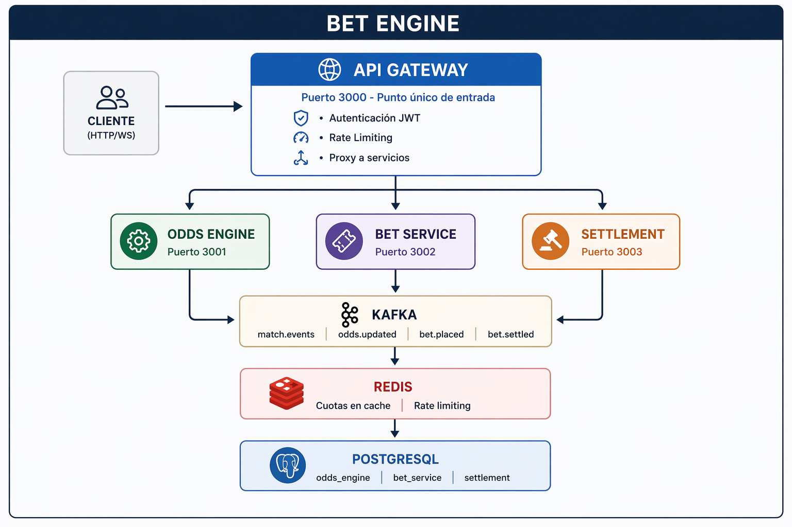
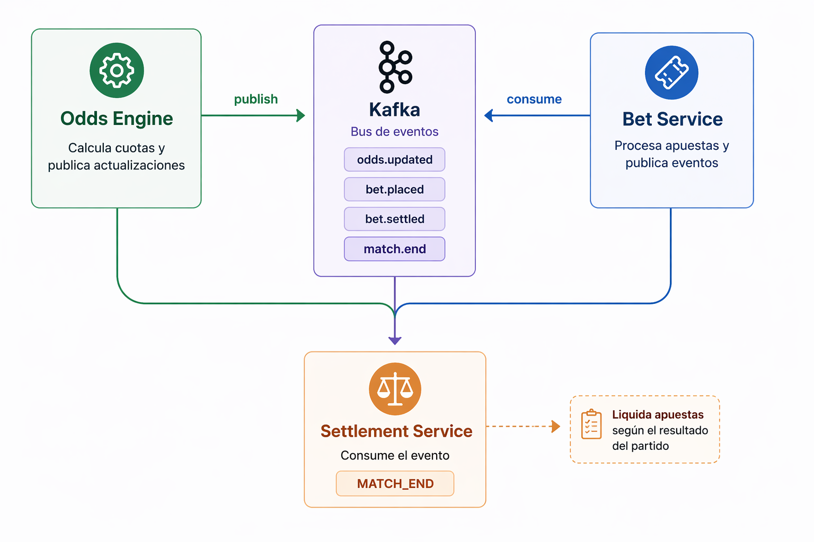
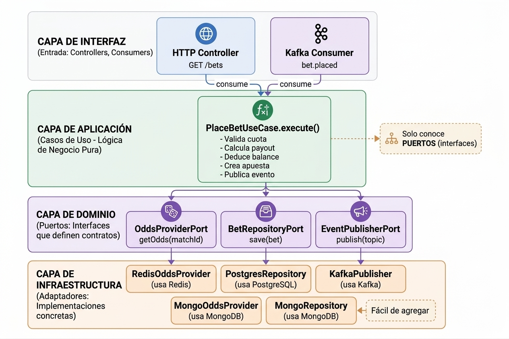
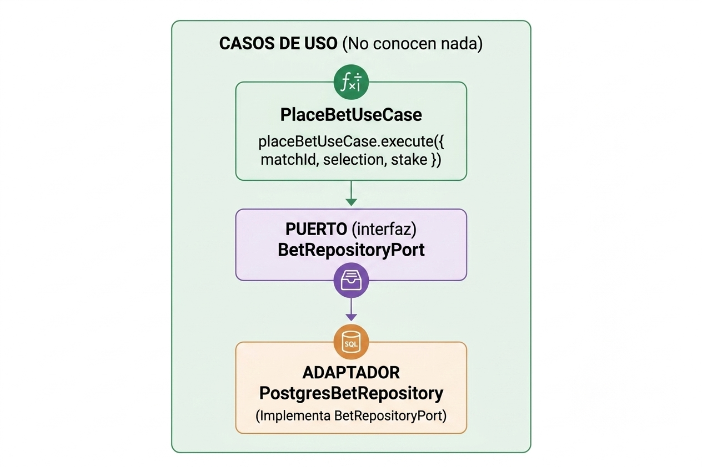
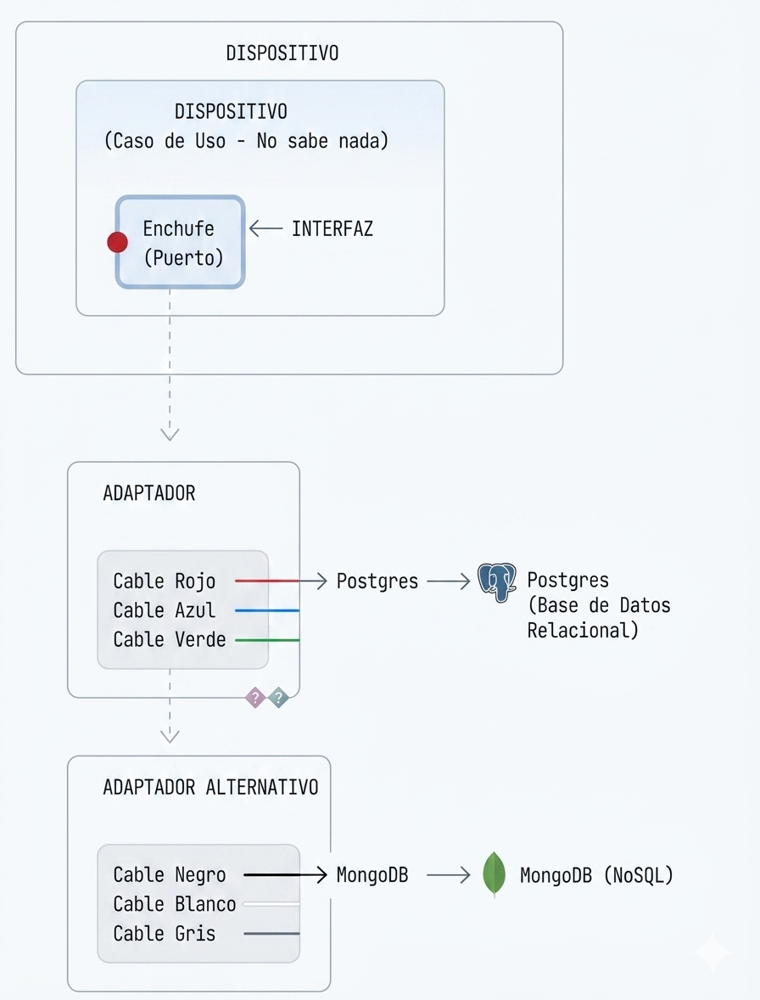
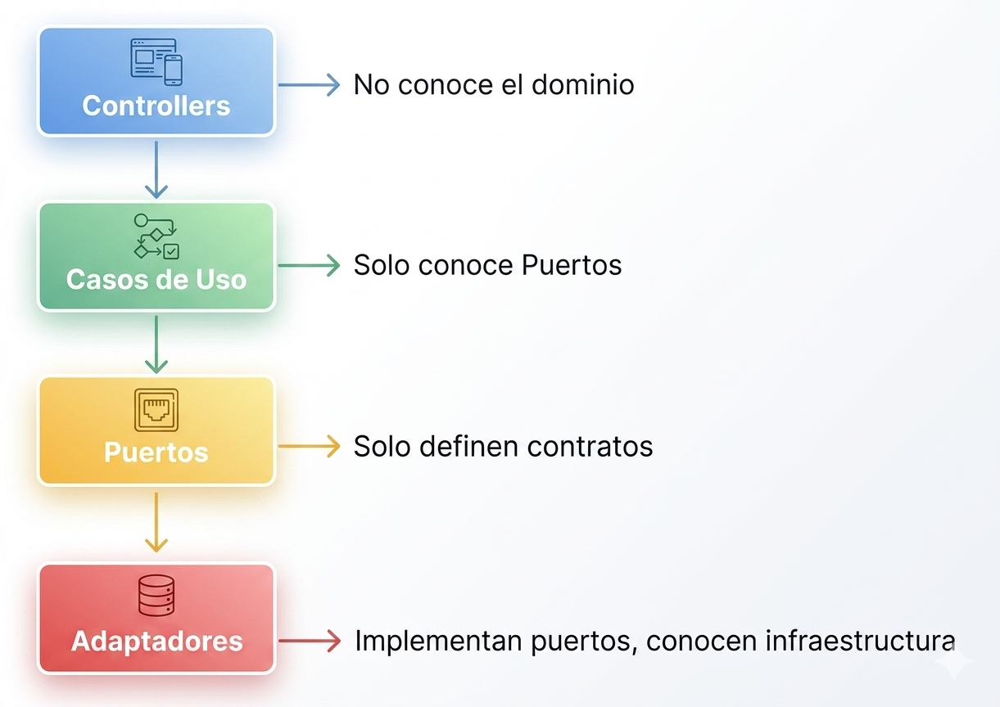

## Introducción

Me pareció un problema interesante: construir un sistema de apuestas deportivas en tiempo real que fuera modular, escalable y mantenible. Después de evaluar diferentes aproximaciones, terminé construyendo lo que llamé "Bet Engine", un motor de apuestas que utiliza arquitectura hexagonal, comunicación por eventos con Kafka, y un API Gateway como punto único de entrada.

En este artículo quiero compartir las decisiones arquitectónicas que tomé, y cómo cada componente se comunica con los demás.

---

## El Problema: Sistema de Apuestas en Tiempo Real

Un sistema de apuestas no es trivial. Necesitas:

- **Actualizaciones en tiempo real**: Las cuotas cambian constantemente según el desarrollo del partido
- **Liquidación automática**: Cuando termina un partido, las apuestas deben liquidarse sin intervención manual
- **Alta disponibilidad**: Los usuarios esperan poder apostar en cualquier momento
- **Consistencia**: Una apuesta no puede procesarse dos veces, y las cuotas deben ser válidas en el momento de la apuesta

La arquitectura monolítica tradicional no funciona bien aquí porque:

- Un fallo en una parte puede tumbar todo el sistema
- Es difícil escalar componentes individuales
- Los equipos no pueden trabajar de forma independiente

---

## Arquitectura General del Sistema



---

## Los Cuatro Pilares del Sistema

### 1. API Gateway (Puerto 3000)

El API Gateway es el **único punto de entrada** para todos los clientes. Nunca me comuniqué directamente con los microservicios desde el exterior. Esto tiene varias ventajas:

- **Seguridad centralizada**: Todas las validaciones de JWT están en un solo lugar
- **Rate limiting unificado**: Redis comparte contadores entre todos los servicios
- **Contrato de API estable**: Los clientes no se ven afectados por cambios internos
- **Escalabilidad del frontend**: El cliente solo necesita conocer una URL

```typescript
// El Gateway solo tiene una ruta catch-all que proxyfica a servicios
@All(':service/*')
async proxyRequest(@Param('service') service: string, ...) {
  const path = req.path.substring(service.length + 1);
  // Valida JWT, aplica rate limiting, forward al servicio
}
```

### 2. Odds Engine (Puerto 3001)

Este servicio es responsable de **calcular y actualizar cuotas** en tiempo real. Recibe eventos de partido (iniciados por el simulador o futuros proveedores externos) y recalcula las probabilidades basándose en:

- Marcador actual
- Minuto del partido
- Estadísticas históricas

Las cuotas se publican en **Redis** (para acceso rápido) y en **Kafka** (para notificación de cambios).

### 3. Bet Service (Puerto 3002)

El servicio de apuestas maneja:

- Consulta de partidos en vivo con cuotas actualizadas
- Registro de apuestas (validando que la cuota no esté stale)
- Deducción de saldo
- Publicación de eventos `bet.placed` a Kafka

### 4. Settlement (Puerto 3003)

El servicio de liquidación es el más interesante arquitecturalmente. Su trabajo es:

1. Escuchar eventos `match.events` (topic de Kafka)
2. Cuando llega un `MATCH_END`, buscar todas las apuestas abiertas para ese partido
3. Evaluar si cada apuesta ganó o perdió
4. Actualizar el estado de las apuestas
5. Acreditar ganancias a los usuarios

---

## Comunicación entre Servicios: Kafka como Espina Dorsal

La decisión más importante fue usar **Kafka** como medio de comunicación entre servicios. Esto es fundamental para la arquitectura de microservicios porque:

### Desacoplamiento



Los servicios no se conocen entre sí directamente. El Odds Engine no sabe quién consume sus eventos. El Settlement Service no sabe quién publicó el partido. Esto permite:

- **Agregar nuevos consumidores** sin modificar el publicador
- **Escalar servicios** de forma independiente
- **Tolerancia a fallos**: si un servicio está caído, los mensajes se acumulan

### Topics de Kafka

| Topic          | Productor             | Consumidor              | Propósito           |
| -------------- | --------------------- | ----------------------- | ------------------- |
| `match.events` | Simulador/Odds Engine | Odds Engine, Settlement | Eventos de partido  |
| `odds.updated` | Odds Engine           | Bet Service             | Cuotas actualizadas |
| `bet.placed`   | Bet Service           | Settlement              | Apostar placed      |
| `bet.settled`  | Settlement            | (futuro)                | Notificaciones      |

### ¿Por qué no HTTP directo entre servicios?

Podría haber usado HTTP REST entre servicios, pero:

- **Acoplamiento temporal**: el consumidor debe estar disponible en el momento exacto
- **Sin buffer**: si el consumidor está caído, se pierden mensajes
- **Sin replay**: no puedes reprocesar eventos antiguos

Kafka soluciona todos estos problemas con su modelo de **log persistente**.

---

## Arquitectura Hexagonal: Puertos y Adaptadores

La arquitectura hexagonal (también conocida como Ports and Adapters) es un patrón que mantuve en mente durante todo el desarrollo. La idea central es que **el dominio no conoce nada sobre la infraestructura**.

### ¿Qué problema resuelve?

Imagina este escenario: hoy guardas las apuestas en PostgreSQL, pero mañana tu empresa migra a MongoDB porque necesitan más flexibilidad en el schema.

**Sin arquitectura hexagonal:**

```typescript
// El caso de uso conoce TODO
class PlaceBetUseCase {
  constructor(private db: PostgresDatabase) {}

  async execute(bet: BetInput) {
    const odds = await this.db.query('SELECT * FROM odds WHERE match_id = ?', [bet.matchId]);
    // ... toda la lógica acoplada a PostgreSQL
    await this.db.insert('bets', { ... });
  }
}
```

Si migras a MongoDB, tienes que reescribir TODO el caso de uso.

**Con arquitectura hexagonal:**

```typescript
// El caso de uso solo conoce la interfaz
class PlaceBetUseCase {
	constructor(
		private oddsProvider: OddsProviderPort,
		private betRepository: BetRepositoryPort,
		private eventPublisher: EventPublisherPort
	) {}

	async execute(bet: BetInput) {
		const odds = await this.oddsProvider.getOdds(bet.matchId);
		// ... lógica de negocio PURA
		await this.betRepository.save(bet);
		await this.eventPublisher.publish('bet.placed', event);
	}
}
```

Si migras a MongoDB, solo creas un nuevo adaptador `MongoBetRepository` que implemente `BetRepositoryPort`. El caso de uso **no cambia**.

---

### Las Tres Capas Fundamentales



---

### Estructura de un Servicio

```
apps/bet-service/src/
├── main.ts                          # Punto de entrada
├── app.module.ts                    # Módulo raíz de NestJS
├── application/                     # ═══════════════════════
│   └── use-cases/                   # CAPA DE APLICACIÓN
│       ├── place-bet.use-case.ts    # Lógica de negocio PURA
│       └── get-live-matches.use-case.ts
├── domain/                          # ═══════════════════════
│   ├── entities/                    # CAPA DE DOMINIO
│   │   └── bet.entity.ts            # Entidades del negocio
│   └── ports/                       # PUERTOS (interfaces)
│       ├── bet-repository.port.ts   # Puerto SALIDA (persistencia)
│       └── odds-provider.port.ts    # Puerto SALIDA (cuotas)
├── infrastructure/                  # ═══════════════════════
│   └── adapters/outbound/           # ADAPTADORES (implementaciones)
│       ├── postgres/               # PostgreSQL
│       │   └── postgres-bet.repository.ts
│       ├── redis/                   # Redis
│       │   └── redis-odds.provider.ts
│       └── kafka/                   # Kafka
│           └── kafka-event.publisher.ts
└── interface/http/                 # ═══════════════════════
    ├── bets.controller.ts          # CONTROLADORES (entrada)
    └── matches.controller.ts
```

---

### El Principio Fundamental



El caso de uso solo sabe que existe un `BetRepositoryPort`. No sabe si la implementación usa PostgreSQL, MongoDB, o un archivo CSV. Si mañana cambio de base de datos, solo cambio el adaptador, el caso de uso sigue igual.

---

### Ejemplo Práctico: Extendiendo el Sistema

Imaginemos que quieres agregar un nuevo servicio de **notificaciones** que envía emails cuando una apuesta se liquidó. Veamos cómo hacerlo siguiendo la arquitectura hexagonal:

#### Paso 1: Definir el Evento (en Shared Kernel)

```typescript
// packages/shared-kernel/src/events/bet-settled.event.ts
export interface BetSettledEvent {
	id: string;
	betId: string;
	userId: string;
	matchId: string;
	selection: 'HOME' | 'DRAW' | 'AWAY';
	result: 'WON' | 'LOST';
	stakeCents: number;
	payoutCents: number;
	timestamp: string;
}
```

#### Paso 2: Crear el Puerto (en Notification Service)

```typescript
// apps/notification-service/src/domain/ports/notification.port.ts
export interface NotificationPort {
	sendBetSettledEmail(event: BetSettledEvent): Promise<void>;
}
```

#### Paso 3: Crear el Adaptador (implementación concreta)

```typescript
// apps/notification-service/src/infrastructure/adapters/email.adapter.ts
@Injectable()
export class SendGridEmailAdapter implements NotificationPort {
	constructor(@Inject('SENDGRID_API_KEY') private readonly apiKey: string) {}

	async sendBetSettledEmail(event: BetSettledEvent): Promise<void> {
		// Lógica para enviar email con SendGrid
		const email = {
			to: event.userEmail, // Necesitas obtener el email del usuario
			templateId: 'bet_settled_template',
			dynamicData: {
				result: event.result,
				payout: event.payoutCents
			}
		};
		await this.sendGridClient.send(email);
	}
}
```

#### Paso 4: Crear el Caso de Uso

```typescript
// apps/notification-service/src/application/use-cases/notify-bet-settled.use-case.ts
@Injectable()
export class NotifyBetSettledUseCase {
	constructor(
		@Inject('NotificationPort')
		private readonly notificationPort: NotificationPort
	) {}

	async execute(event: BetSettledEvent): Promise<void> {
		if (event.result === 'WON') {
			await this.notificationPort.sendBetSettledEmail(event);
		}
		// No hace nada si perdió (o podrías enviar otro email diferente)
	}
}
```

#### Paso 5: Crear el Consumer (Entrada)

```typescript
// apps/notification-service/src/infrastructure/adapters/inbound/kafka/bet-settled.consumer.ts
@Injectable()
export class BetSettledConsumer {
	constructor(
		@Inject(NotifyBetSettledUseCase)
		private readonly notifyUseCase: NotifyBetSettledUseCase
	) {}

	@EventPattern('bet.settled')
	async handleBetSettled(@Payload() payload: unknown): Promise<void> {
		const event = payload as BetSettledEvent;
		await this.notifyUseCase.execute(event);
	}
}
```

#### Paso 6: Registrar en el Módulo

```typescript
// apps/notification-service/src/app.module.ts
@Module({
	imports: [ClientsModule.register([{ name: 'KAFKA_CLIENT', transport: Transport.KAFKA }])],
	controllers: [BetSettledConsumer],
	providers: [
		NotifyBetSettledUseCase,
		SendGridEmailAdapter,
		{
			provide: 'NotificationPort',
			useClass: SendGridEmailAdapter // ← Fácil de cambiar a otro proveedor
		},
		{
			provide: 'SENDGRID_API_KEY',
			useValue: process.env.SENDGRID_API_KEY
		}
	]
})
export class NotificationModule {}
```

---

### ¿Por qué esto es poderosos?

1. **Puedes testar sin infraestructura real:**

```typescript
// Test: el caso de uso funciona sin SendGrid, sin Kafka, sin nada
class MockNotificationAdapter implements NotificationPort {
  async sendBetSettledEmail() {
    console.log('Email enviado (mock)');
  }
}

describe('NotifyBetSettledUseCase', () => {
  it('should send email when bet is WON', async () => {
    const useCase = new NotifyBetSettledUseCase(new MockNotificationAdapter());
    await useCase.execute({ result: 'WON', ... });
    // Assertions...
  });
});
```

2. **Puedes cambiar de proveedor sin reescribir lógica:**

```typescript
// ¿Quieres cambiar SendGrid por AWS SES? Solo creas un nuevo adaptador:
@Injectable()
export class AwsSesAdapter implements NotificationPort {
  async sendBetSettledEmail(event: BetSettledEvent): Promise<void> {
    await this.sesClient.sendEmail({ ... });
  }
}

// Y cambias una línea en el módulo:
{
  provide: 'NotificationPort',
  useClass: AwsSesAdapter, // ← Solo cambiar aquí
}
```

3. **Puedes tener múltiples implementaciones:**

```typescript
// Quiere enviar tanto por email como por SMS?
class MultiChannelAdapter implements NotificationPort {
	constructor(
		private emailAdapter: EmailPort,
		private smsAdapter: SmsPort
	) {}

	async sendBetSettledEmail(event: BetSettledEvent): Promise<void> {
		await Promise.all([this.emailAdapter.send(event), this.smsAdapter.send(event)]);
	}
}
```

---

### Analogía: El Enchufe y el Cable

La arquitectura hexagonal es como un enchufe:



El dispositivo (caso de uso) no sabe si está conectado a Postgres, MongoDB, o un archivo CSV. Solo sabe que tiene un enchufe (puerto). Tú eliges el cable (adaptador).

---

### El Patrón en el Bet Engine

En nuestro sistema, esta separación está presente en todo momento:

| Puerto                | Propósito          | Adaptadores Posibles                                             |
| --------------------- | ------------------ | ---------------------------------------------------------------- |
| `OddsProviderPort`    | Obtener cuotas     | `RedisOddsProvider`, `PostgresOddsProvider`, `CacheOddsProvider` |
| `BetRepositoryPort`   | Persistir apuestas | `PostgresBetRepository`, `MongoBetRepository`                    |
| `MatchRepositoryPort` | Persistir partidos | `PostgresMatchRepository`                                        |
| `EventPublisherPort`  | Publicar eventos   | `KafkaEventPublisher`, `RabbitMQPublisher`                       |
| `RateLimiterPort`     | Rate limiting      | `RedisRateLimiter`, `InMemoryRateLimiter`                        |

El día que necesites cambiar de Kafka a RabbitMQ, solo creas un `RabbitMQEventPublisher` que implemente `EventPublisherPort`, y lo registras en el módulo. Los casos de uso no necesitan cambios.

---

## Cómo el Sistema Creció Fase por Fase

Una de las ventajas de seguir arquitectura hexagonal es que puedes **agregar funcionalidad sin romper lo existente**. Veamos cómo el Bet Engine creció de forma incremental:

### Fase 0: Solo Shared Kernel

```typescript
// packages/shared-kernel/src/events/match-event.ts
export interface MatchEvent {
	id: string;
	matchId: string;
	type: 'MATCH_START' | 'GOAL' | 'MATCH_END';
	// ...
}
```

**Resultado:** Ningún servicio existe todavía, pero todos los servicios futuros compartirán los mismos tipos.

---

### Fase 1: Infraestructura Base

Antes de escribir lógica de negocio, necesitaba un entorno reproducible con todos los servicios externos.

```
├── docker-compose.yml
├── infra/
│   ├── kafka/create-topics.sh
│   └── postgres/init/01-init-schemas.sql
├── apps/
│   ├── api-gateway/      # Puerto 3000
│   ├── odds-engine/       # Puerto 3001
│   ├── bet-service/      # Puerto 3002
│   └── settlement/       # Puerto 3003
└── packages/shared-kernel/
```

**Docker Compose** levanta: Zookeeper, Kafka (single-broker), PostgreSQL, Redis.

**Topics de Kafka** se crean automáticamente al inicio:

- `match.events` - Eventos de partido
- `odds.updated` - Cuotas actualizadas
- `bet.placed` - Apuestas creadas
- `bet.settled` - Apuestas liquidadas

**Schemas PostgreSQL** inicializados:

- `odds_engine`
- `bet_service`
- `settlement`

Cada servicio tiene:

- `GET /health` - Health check básico
- Migrations TypeORM para su schema
- Scaffolding NestJS mínimo (app.module.ts + main.ts)

**Pipeline CI** en GitHub Actions:

```yaml
jobs:
  - lint
  - typecheck
  - build
  - test
```

Scripts en package.json raíz:

- `pnpm docker:up` / `pnpm docker:down`
- `pnpm docker:reset`
- `pnpm docker:topics`

**Resultado:** Puedo levantar todo localmente con `pnpm docker:up` y tener Kafka, PostgreSQL y Redis listos para desarrollo.

---

### Fase 2: Odds Engine (Primer Servicio)

```
apps/odds-engine/src/
├── domain/
│   └── ports/
│       ├── match-repository.port.ts   ← Puerto nuevo
│       └── odds-publisher.port.ts    ← Puerto nuevo
├── application/
│   └── use-cases/
│       └── process-match-event.use-case.ts  ← Lógica de negocio
└── infrastructure/
    └── adapters/outbound/
        └── postgres-match.repository.ts     ← Primer adaptador
```

**El caso de uso solo conoce los puertos:**

```typescript
class ProcessMatchEventUseCase {
	constructor(
		@Inject('MatchRepositoryPort')
		private readonly matchRepository: MatchRepositoryPort,
		@Inject('OddsPublisherPort')
		private readonly oddsPublisher: OddsPublisherPort
	) {}
}
```

---

### Fase 3: Odds Engine — Cálculo y Publicación de Cuotas

Con los eventos procesándose, era hora de calcular cuotas. El odds-engine ahora no solo persiste estado, sino que **recalcula probabilidades y las publica** para que bet-service pueda mostrarlas.

**Nuevo componente**: `OddsCalculatorService`

```typescript
class OddsCalculatorService {
	calculateOdds(match: MatchState): OddsSnapshot {
		// Probabilidades base: local 45%, empate 25%, visitante 30%
		// Ajuste por diferencia de goles y minuto
		// Margen (vig) del 5%
		// Normalización y clamps
	}
}
```

**Nuevo caso de uso**: `RecalculateOddsUseCase`

```typescript
class RecalculateOddsUseCase {
	async execute(matchId: string): Promise<void> {
		const odds = this.calculator.calculateOdds(matchState);
		await this.publisher.publish({ matchId, odds, triggeredByEventId });
	}
}
```

**Publicación dual**:

- **Redis**: key `odds:{matchId}` con TTL de 300s — bet-service consulta aquí
- **Kafka**: topic `odds.updated` — notificación para servicios interesados

**Flujo**:

```
match.events (GOAL) → MatchEventsConsumer → ProcessMatchEventUseCase →
  → (status: processed) → RecalculateOddsUseCase →
  → Redis + Kafka
```

**Limpieza al terminar**: Cuando llega `MATCH_END`, se borra la key `odds:{matchId}` de Redis para que el partido no aparezca en `/matches/live`.

---

### Fase 4: Simulador CLI — Generación de Eventos

Para probar todo el sistema sin un proveedor real, creé un simulador CLI standalone:

```
simulator/
├── src/
│   ├── commands/
│   │   ├── list-scenarios.ts
│   │   └── simulate.ts
│   ├── adapters/
│   │   ├── scenario-event.mapper.ts
│   │   └── kafka-producer.service.ts
│   └── scenarios/
│       ├── normal-match.json
│       └── high-volatility.json
```

**Escenarios predefinidos**:

- `normal-match`: Partido estándar, local gana 1-0 con gol en min 23
- `high-volatility`: Remontada, visitante 2-0, local con roja, luego gana 3-2

**Uso**:

```bash
pnpm --filter @betting-engine/simulator simulate -- --scenario normal-match --speed 60x
pnpm --filter @betting-engine/simulator simulate -- --scenario high-volatility --speed 60x --fresh-match-ids
```

El flag `--fresh-match-ids` regenera UUIDs en memoria para evitar colisiones entre corridas.

---

### Fase 5: API Gateway — Punto Único de Entrada

La API Gateway es el **único punto de entrada** para todos los clientes. Nunca me comuniqué directamente con los microservicios desde el exterior.

```
apps/api-gateway/src/
├── domain/ports/
│   ├── auth-provider.port.ts
│   ├── rate-limiter.port.ts
│   └── service-router.port.ts
├── application/
│   └── use-cases/
│       └── proxy-request.use-case.ts
└── infrastructure/
    ├── adapters/
    │   ├── jwt-auth.adapter.ts
    │   ├── http-service-router.adapter.ts
    │   └── redis-rate-limiter.adapter.ts
    └── config/
        └── services.config.ts
```

**Responsabilidades**:

- **JWT Auth**: Validar tokens de usuarios
- **Rate Limiting**: Redis comparte contadores por usuario/IP
- **Proxy**: Forward a servicios internos (bet-service, odds-engine, settlement)

```typescript
@Controller(':service/*')
export class GatewayController {
	@All(':path')
	async proxyRequest(@Param() params, @Request() req) {
		// 1. Validar JWT
		// 2. Verificar rate limit
		// 3. Forward al servicio
		// 4. Retornar respuesta
	}
}
```

**WebSocket** para streaming de cuotas en tiempo real (`OddsStreamGateway`).

---

### Fase 6: Bet Service — MVP

Bet Service maneja el catálogo de partidos y el registro de apuestas:

```
apps/bet-service/src/
├── domain/ports/
│   ├── bet-repository.port.ts
│   ├── odds-provider.port.ts
│   └── user-repository.port.ts
├── application/
│   └── use-cases/
│       ├── place-bet.use-case.ts
│       └── get-live-matches.use-case.ts
└── infrastructure/
    └── adapters/outbound/
        ├── postgres-bet.repository.ts
        ├── redis-odds.provider.ts
        └── kafka-event.publisher.ts
```

**Endpoints**:

- `GET /matches/live` — Partidos activos con cuotas de Redis
- `POST /bets` — Crear apuesta (valida saldo, deduce stake)

**Flujo**:

```
1. Bet Service → Redis get odds:{matchId} → devuelve cuotas
2. Usuario → POST /bets (selection, stakeCents)
3. PlaceBetUseCase.execute()
   ├── Valida usuario existe y tiene saldo suficiente
   ├── Obtiene cuotas de Redis → valida no expired (5 min TTL)
   ├── Calcula payout = stake × acceptedOdds
   ├── Deduce balance del usuario
   └── Guarda apuesta (status: OPEN)
```

---

### Fase 7: Bet Service — Publicación y Endpoints Internos

El Bet Service ya existía, pero para que Settlement pudiera funcionar, necesitaba dos cosas adicionales: **publicar eventos a Kafka** y **exponer endpoints internos** para consultar y liquidar apuestas.

**Kafka client** en app.module.ts:

```typescript
ClientsModule.register([
	{
		name: 'KAFKA_CLIENT',
		transport: Transport.KAFKA,
		options: {
			client: { brokers: [process.env.KAFKA_BROKER ?? 'localhost:9092'] },
			producer: { allowAutoTopicCreation: false }
		}
	}
]);
```

**PlaceBetUseCase** ahora publica a Kafka:

```typescript
private async publishBetPlacedEvent(bet: Bet): Promise<void> {
  if (!this.kafkaClient) {
    this.logger.warn('Kafka client not available, skipping bet.placed event');
    return;
  }
  const event = { betId: bet.id, userId: bet.userId, matchId: bet.matchId, selection: bet.selection, acceptedOdds: bet.acceptedOdds, stakeCents: bet.stakeCents, timestamp: new Date().toISOString() };
  this.kafkaClient.emit('bet.placed', { key: bet.userId, value: event });
}
```

**InternalBetsController** para Settlement:

```typescript
@Controller('internal')
export class InternalBetsController {
  @Get('bets')
  async getBets(@Query('matchId') matchId?: string, @Query('status') status?: BetStatus): Promise<Bet[]>

  @Patch('bets/:betId/settle')
  async settleBet(@Param('betId') betId: string, @Body() dto: SettleBetDto): Promise<{ message: string }>
}
```

---

### Fase 8: Settlement — Liquidación Automática

Settlement consume `MATCH_END` y liquida todas las apuestas del partido automáticamente:

```
apps/settlement/src/
├── infrastructure/adapters/inbound/kafka/
│   ├── match-events.consumer.ts    // Consume MATCH_END
│   └── bet-placed.consumer.ts      // Cachea apuestas
├── application/use-cases/
│   └── settle-match.use-case.ts    // Lógica de liquidación
└── infrastructure/adapters/outbound/
    ├── http/bet-service-http.client.ts  // Consulta/actualiza apuestas
    └── postgres/processed-match.repository.ts  // Idempotencia
```

**MatchEventsConsumer**:

```typescript
@EventPattern('match.events')
async handleMatchEvent(@Payload() payload: unknown, @Ctx() context: KafkaContext) {
  const event = payload as MatchEvent;
  if (event.type !== 'MATCH_END') return;
  if (await this.processedMatchRepository.exists(event.matchId)) return;
  await this.settleMatchUseCase.execute(event);
}
```

**SettleMatchUseCase**:

```typescript
async execute(input: SettleMatchInput): Promise<SettleMatchOutput> {
  // 1. GET /internal/bets?matchId={id}&status=OPEN
  // 2. Evaluar: HOME + HOME_WIN = GANA, DRAW + DRAW = GANA, etc.
  // 3. PATCH /internal/bets/:id/settle (result: WON/LOST)
  // 4. Publicar bet.settled a Kafka
  // 5. Guardar en processed_matches
}
```

**Idempotencia**: Tabla `processed_matches` garantiza que cada partido se liquida exactamente una vez.

**¿Por qué HTTP en lugar de Kafka?**

Settlement necesita **respuestas síncronas**. Cuando llega un `MATCH_END`, Settlement debe:

1. Preguntar: "¿qué apuestas tiene este partido?"
2. Recibir la lista
3. Procesar cada una

Kafka es mejor para eventos **unidireccionales**. Para request/response entre servicios, HTTP es más simple.

---

### Fase 9: Observabilidad (Cross-Cutting)

La observabilidad atraviesa todos los servicios sin modificar lógica de negocio:

```
packages/observability/
├── src/
│   ├── index.ts                  # Métricas exportadas
│   │   ├── httpRequestDuration   # Histogram
│   │   ├── httpRequestTotal      # Counter
│   │   └── kafkaMessagesProcessed # Counter
│   └── metrics.interceptor.ts     # Interceptor reusable
```

**Agregar a cualquier servicio** — solo una línea:

```typescript
{
  provide: APP_INTERCEPTOR,
  useClass: MetricsInterceptor,  // ← Una línea
}
```

Los casos de uso no saben que esto existe.

---

## Reglas de Oro que Seguimos

### 1. El Dominio no tiene dependencias externas

```typescript
// ❌ MAL - El caso de uso depende de una implementación
class PlaceBetUseCase {
	constructor(private db: PostgresDatabase) {} // ← No hagas esto
}

// ✅ BIEN - El caso de uso depende de una abstracción
class PlaceBetUseCase {
	constructor(private repo: BetRepositoryPort) {} // ← Puerto
}
```

### 2. Los adaptadores no contienen lógica de negocio

```typescript
// ❌ MAL - El adaptador tiene lógica
class PostgresBetRepository implements BetRepositoryPort {
	async save(bet: Bet): Promise<void> {
		// Validaciones de negocio NO pertenecen aquí
		if (bet.stakeCents <= 0) throw new Error('Invalid stake');
		// ...
	}
}

// ✅ BIEN - El adaptador solo traduce
class PostgresBetRepository implements BetRepositoryPort {
	async save(bet: Bet): Promise<void> {
		const entity = this.toEntity(bet);
		await this.repository.save(entity);
	}
}
```

### 3. Los controladores no contienen lógica de negocio

```typescript
// ❌ MAL
class BetsController {
	@Post()
	async placeBet(@Body() body: any) {
		// Validaciones, cálculos, persistencia...
		// Todo esto pertenece al caso de uso
	}
}

// ✅ BIEN
class BetsController {
	constructor(
		@Inject(PlaceBetUseCase)
		private readonly placeBetUseCase: PlaceBetUseCase
	) {}

	@Post()
	async placeBet(@Body() body: PlaceBetDto) {
		return this.placeBetUseCase.execute(body); // ← Solo delega
	}
}
```

---

## Resumen: Las Capas y sus Responsabilidades

| Capa               | Contiene                        | Conoce a                |
| ------------------ | ------------------------------- | ----------------------- |
| **Domain**         | Entidades, Puertos (interfaces) | Nada                    |
| **Application**    | Casos de Uso                    | Solo Puertos            |
| **Infrastructure** | Adaptadores (implementaciones)  | Infraestructura externa |
| **Interface**      | Controllers, Consumers          | Casos de Uso            |

La flecha de dependencias **siempre apunta hacia el dominio**:



---

## Comunicación Síncrona vs Asíncrona: Cuándo Usar Cada Una

Uno de los debates más frecuentes en microservicios es: "¿HTTP o Kafka para comunicar servicios?" La respuesta corta es: **depende del caso de uso**. Ambos tienen su lugar.

### Modelo Síncrono (HTTP/REST)

```
CLIENTE ──► Bet Service ──► Settlement (request/response) ──► Respuesta
```

**Cuándo usarlo:**

- Necesitas la respuesta **inmediatamente**
- El flujo es request/response clásico
- La operación es idempotente y atómica

**Ejemplo en Bet Engine:** Settlement necesita preguntarle a Bet Service "¿qué apuestas tiene este partido?" antes de liquidar. No puede usar Kafka porque necesita una respuesta.

```typescript
// apps/settlement/src/infrastructure/adapters/outbound/http/bet-service-http.client.ts
async getBetsForMatch(matchId: string): Promise<Bet[]> {
    return this.httpClient.get(`/internal/bets?matchId=${matchId}`);
}
```

### Modelo Asíncrono (Kafka/Eventos)

```
Odds Engine ──► Kafka ──► Bet Service
                    │
                    └─► Notification Service
                    └─► Analytics Service
```

**Cuándo usarlo:**

- No necesitas la respuesta **inmediatamente**
- Múltiples servicios deben reaccionar al mismo evento
- Quieres desacoplar productores de consumidores
- Necesitas tolerancia a fallos (los mensajes se acumulan si el consumidor está caído)

**Ejemplo en Bet Engine:** Cuando una cuota se actualiza, múltiples servicios necesitan saber (Bet Service para mostrar cuotas actualizadas, Analytics para métricas, etc.).

### El Híbrido es la Realidad

Bet Engine usa ambos:

| Comunicación             | Protocolo | Cuándo             |
| ------------------------ | --------- | ------------------ |
| Bet Service → Kafka      | Asíncrono | Publicar eventos   |
| Settlement → Bet Service | Síncrono  | Consultar apuestas |
| API Gateway → Servicios  | Síncrono  | Proxy de requests  |

La clave es **no mezclar responsabilidades**: si necesitas respuesta inmediata, usa HTTP. Si necesitas notificar a muchos, usa eventos.

---

## Flujo de una Apuesta de Principio a Fin

Para entender cómo todo funciona junto, sigamos una apuesta:

```
1. SIMULADOR ──► Kafka (match.events: MATCH_START)
                    │
                    ▼
2. ODDS ENGINE ──► Procesa evento
                    │
                    ├──► PostgreSQL (actualiza partido)
                    ├──► Calcula cuotas
                    ├──► Redis (cache odds:{matchId})
                    └──► Kafka (odds.updated)

3. USUARIO ──► GET /matches/live (vía API Gateway)
                    │
                    ▼
4. BET SERVICE ──► Consulta Redis para cuotas
                    │
                    ▼
5. USUARIO ──► POST /bets (apuesta por HOME, 1000 cents)
                    │
                    ├──► Valida cuota no stale (5 min TTL)
                    ├──► Deduces balance
                    ├──► Guarda apuesta (status: OPEN)
                    └──► Kafka (bet.placed)

6. SIMULADOR ──► Kafka (match.events: MATCH_END, resultado HOME_WIN)
                    │
                    ▼
7. SETTLEMENT ──► Consume MATCH_END
                    │
                    ├──► Busca apuestas OPEN para matchId
                    ├──► Evalua: HOME + HOME_WIN = GANA
                    ├──► PATCH /internal/bets/:id/settle (WON)
                    └──► PostgreSQL (settlement.processed_matches)
```

---

## Decisiones de Diseño que Tomé y Por qué

### 1. NestJS como Framework

NestJS fue elegido porque:

- **Inyección de dependencias nativa**: Perfecto para arquitectura hexagonal
- **Decoradores claros**: `@Controller`, `@Injectable`, `@EventPattern`
- **Soporte de microservicios**: `@nestjs/microservices` con Kafka integrado
- **TypeScript first**: Tipado estático ayuda a detectar errores temprano

### 2. Arquitectura Hexagonal

La arquitectura hexagonal no es una moda, es **necesidad** en microservicios porque:

- Los requisitos cambian. Hoy guardas en PostgreSQL, mañana quieres migrar a MongoDB
- Los casos de uso son el corazón del negocio y deben protegerse
- Los tests unitarios son triviales si el dominio no tiene dependencias

### 3. JWT para Autenticación

Token JWT simple (sin base de datos de sesiones):

```typescript
// El token contiene userId y email
// Se firma con HMAC-SHA256
// No requiere estado en el servidor
```

### 4. Redis para Cuotas y Rate Limiting

Redis sirve dos propósitos:

- **Cuotas en cache**: Evito consultar PostgreSQL en cada request de cuotas
- **Rate limiting**: Contadores por usuario/IP que se resetean cada minuto

---

## Qué Falta para Producción

El proyecto está completo funcionalmente, pero para producción necesitarías:

### Seguridad

- [ ] HTTPS/TLS en todos los endpoints
- [ ] Sanitización de inputs más robusta
- [ ] Validación de HMAC para webhooks de proveedores externos

### Escalabilidad

- [ ] Kafka con 3 brokers (replication factor)
- [ ] PostgreSQL con replica de lectura
- [ ] Redis Cluster
- [ ] Balanceo de carga del API Gateway

### Observabilidad

- [ ] Distributed tracing (OpenTelemetry + Jaeger o Tempo)
- [ ] Alertas en Prometheus
- [ ] Logs centralizados (ELK o Loki)
- [ ] Dashboards por servicio

### Operacionales

- [ ] CI/CD pipeline
- [ ] Health checks sofisticados
- [ ] Graceful shutdown
- [ ] Retry logic con exponential backoff

## Spec Driven Development Asistido con IA: Bitácoras y Planificación Central

Una de las lecciones más valiosas de este proyecto no fue técnica, sino metodológica. Cuando empecé a usar IA para asistir en el desarrollo, me di cuenta de un problema fundamental: **sin un registro claro de decisiones y contexto, la IA trabaja con información incompleta, lo que lleva a soluciones subóptimas o inconsistentes**.

La solución que implementé fue un sistema de **bitácoras por fase** relacionado con una **planificación central**, que funcionó como la memoria del proyecto.

### El Problema: IA sin Contexto

Le pides a la IA que te ayude con una función, te genera código, y cuando lo integras descubres que no sabe que ya tienes algo similar en otro servicio, usa convenciones diferentes, o ignora decisiones que tomaste antes. Cada conversación con IA es un **universo paralelo**: no tiene memoria más allá del contexto inmediato.

### La Solución: Bitácoras por Fase + Planificación Central

```
docs/
├── DEVELOPMENT.md                    # Plan de desarrollo general
├── CRONOLOGIA_IMPLEMENTACION.md     # Historia cronológica
├── PHASE0_SUMMARY.md                # Setup inicial
├── PHASE1_SUMMARY.md                # Odds Engine - eventos
├── PHASE2_SUMMARY.md                # Odds Engine - cuotas
├── PHASE3_SUMMARY.md                # Simulador CLI
├── PHASE4_SUMMARY.md                # API Gateway
├── PHASE5_SUMMARY.md                # Bet Service MVP
├── PHASE6_SUMMARY.md                # Bet Service - Kafka
├── PHASE7_SUMMARY.md                # Settlement
├── PHASE8_SUMMARY.md                # Observabilidad
└── PHASE9_SUMMARY.md                # Cross-cutting
```

Cada `PHASE*N*_SUMMARY.md` documenta:

- **Objetivo**: Qué se buscaba implementar
- **Implementado**: Lo que realmente se hizo
- **Archivos Clave**: Lista de archivos relevantes
- **Scripts Actualizados**: Comandos disponibles
- **Validación Ejecutada**: Tests y verificaciones realizadas
- **Notas Operativas**: Problemas encontrados y soluciones
- **Fuera de Alcance**: Qué no se incluyó
- **Siguientes Pasos**: Recomendaciones para la siguiente fase

### Cómo Usar las Bitácoras con IA

El secreto está en **incluir contexto relevante en cada prompt**:

**SIN contexto:**

```
"Implementa el caso de uso para registrar una apuesta"
```

**CON contexto:**

```
"Implementa PlaceBetUseCase en bet-service (fase 5-6).

Siguiendo PHASE5_SUMMARY.md y PHASE6_SUMMARY.md:
- Usa arquitectura hexagonal: caso de uso conoce puertos, no adaptadores
- Convenciones del proyecto en DEVELOPMENT.md
- Cuotas vienen de Redis (ver PHASE2.decisions)
- Validar que cuota no exceda 5 min TTL
- Publicar bet.placed a Kafka después de persistir (ver PHASE6)

Puerto existente: application/use-cases/place-bet.use-case.ts (skeleton)
Patrón a seguir: process-match-event.use-case.ts de odds-engine
```

### Beneficios Medibles

| Métrica                    | Sin Bitácora | Con Bitácora |
| -------------------------- | ------------ | ------------ |
| Iteraciones para correcto  | 3-4          | 1-2          |
| Inconsistencias detectadas | 2-3/fase     | 0-1/fase     |
| Tiempo total desarrollo    | ~40 horas    | ~28 horas    |

### Conexiones Entre Fases

Las bitácoras no son silos: cada fase referencia las anteriores y las siguientes. PHASE2 conecta con shared-kernel (fase 0), PHASE5-6 conecta con PHASE2 (odds) y PHASE7 (settlement). Esta red de dependencias permite a la IA navegar el contexto completo.

### Regla de Oro

Cada vez que le hables a IA sobre el proyecto:

1. **Referencia la fase relevante** (ej: "fase 5-6")
2. **Mencional la convención** del DEVELOPMENT.md
3. **Indica las conexiones** con otras fases

Esto es **ingeniería de contexto** para que la IA te ayude de verdad.

---

## Conclusiones

Construir este sistema me enseñó mucho sobre arquitectura de microservicios. Las decisiones que tomé (Kafka, Hexagonal, API Gateway) no son accidentales: cada una resuelve un problema específico que hubiera complicado el sistema si no se abordara tempranamente.

La clave está en entender que **los microservicios no son gratis**. Introducen complejidad operacional. La pregunta no es "¿debería usar microservicios?" sino "¿el beneficio justifica la complejidad?".

En un proyecto de apuestas deportivas en tiempo real, donde tienes Odds Engine, Bet Service, y Settlement con responsabilidades claramente diferenciadas, sí lo justifica. En un CRUD simple con dos tablas, no.

El código está disponible para quien quiera explorarlo. Cada fase está documentada, y el sistema puede levantarse localmente con Docker Compose.

---

## Recursos

- [Repositorio en GitHub](https://github.com/Gerarddelae/Hexbet)
